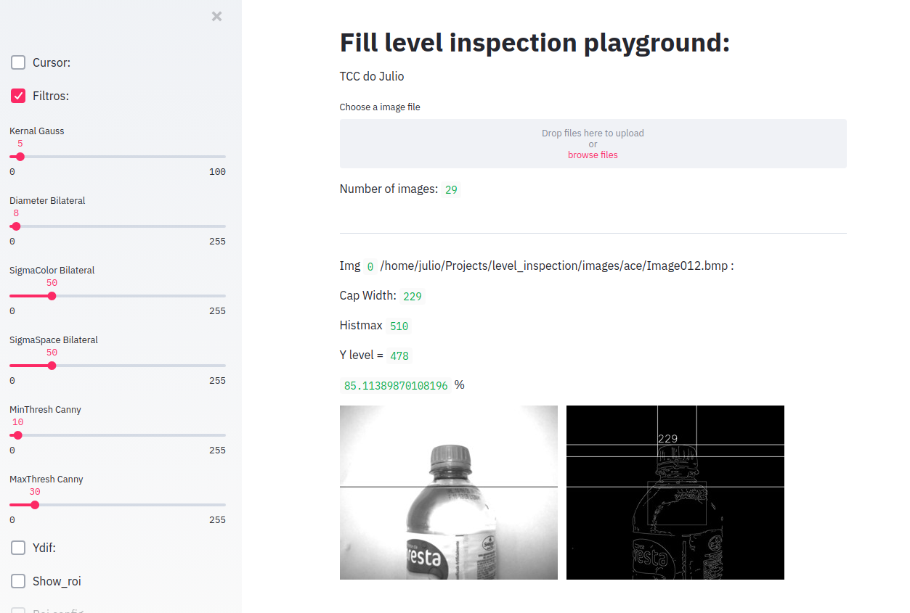

# Fill level inspection

- Esse projeto é referente a inspeção de nivel de líquidos em garrafas plástica.
- Projeto de Diplomação: Julio Milani de Lucena 
- Engenharia Elétrica - UFRGS 2020



## Getting Started
```
$ git clone https://gitlab.com/alter-vision/level_inspection.git
$ cd level_inspection

Instalar todos os pacotes necessários:
$ pip install requirements.txt
$ streamlit run st_app.py

Ou rodar por docker:
$ sudo docker-compose up

$ sudo heroku container:push web
$ sudo heroku container:release web
$ heroku open
```

## Authors

* **Julio Milani de Lucena** - UFRGS - julio.lucena@ufrgs.br
Alter Vision::Visão Inteligente
www.altervision.com.br 